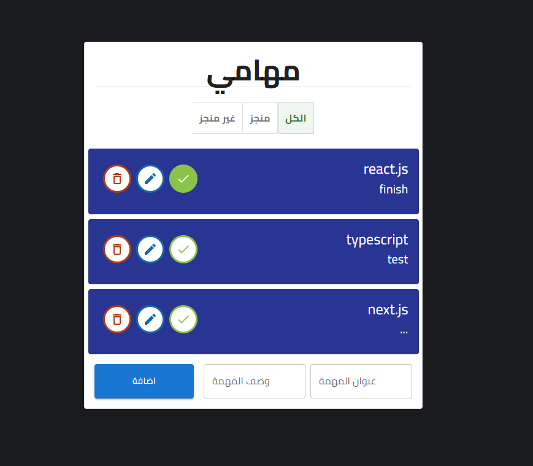

# ✅ React Todo App

A modern and responsive **Todo List App** built using **React** and **Material UI (MUI)**. This app helps users manage their daily tasks with a clean interface, real-time interactivity, and persistent data storage.

## 🚀 Tech Stack

- **React** – Frontend library  
- **Material UI (MUI)** – Component-based design system  
- **Local Storage** – To persist todos across sessions

## ✨ Features

✅ Add new tasks  
✅ Edit existing tasks  
✅ Mark tasks as completed or uncompleted  
✅ Delete individual tasks  
✅ Filter tasks (All / Completed / Uncompleted)  
✅ Responsive design using MUI Grid & Layout system  
✅ Data stored in localStorage  

## 📸 Preview

## 🚀 Live Demo

[🔗 View Live Demo](https://react-todo-15.netlify.app)